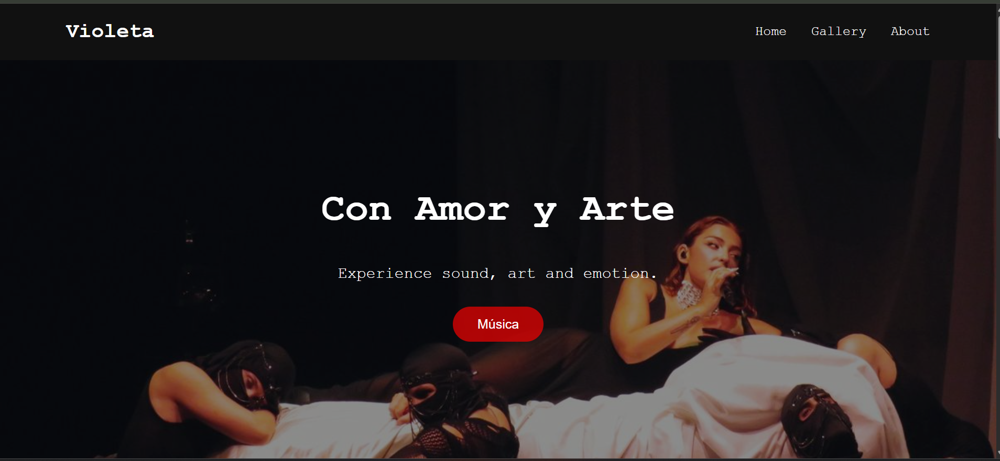
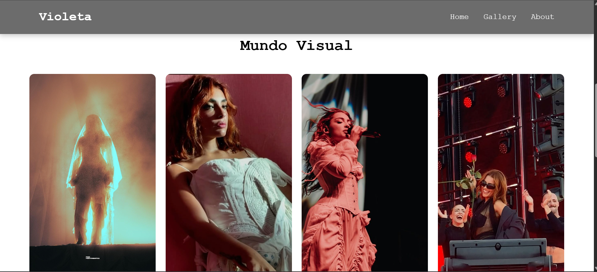
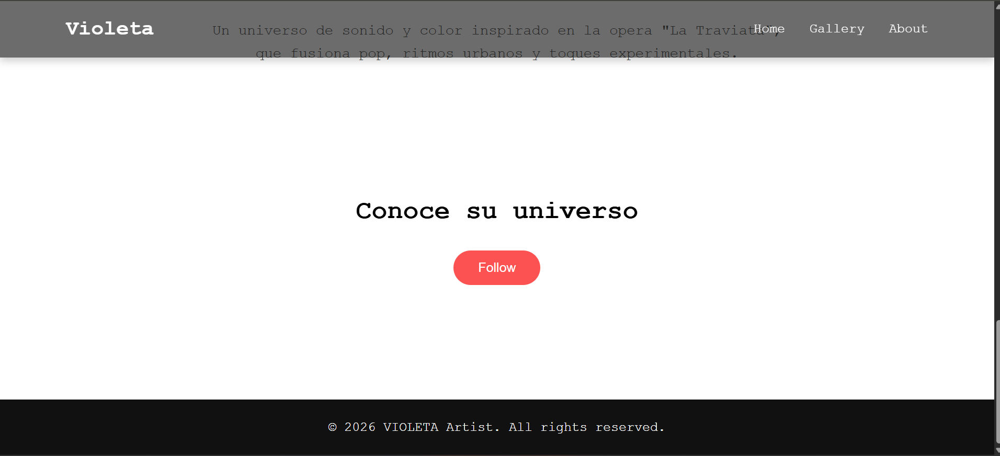

# Artist Landing Page

Landing page estética inspirada en un proyecto artístico.  
Este proyecto demuestra estructura semántica HTML, layout moderno con CSS y pequeñas interacciones con JavaScript.

---

## Preview

### Gallery Section

### CTA Section

---

## Features

- Responsive layout
- Hero section con imagen
- Galería con CSS Grid
- Animaciones al hacer scroll
- Navbar sticky interactiva
- Hover animations
- Smooth scrolling

---

## Technologies

- HTML5
- CSS3
- JavaScript

---

## Project Structure
project
│
├── index.html
├── css
│ └── styles.css
├── js
│ └── script.js
└── assets
└── images

---

## Live Demo

https://valeriaog17-tech.github.io/artist-landing-page/

---

## Author

Valeria Olvera